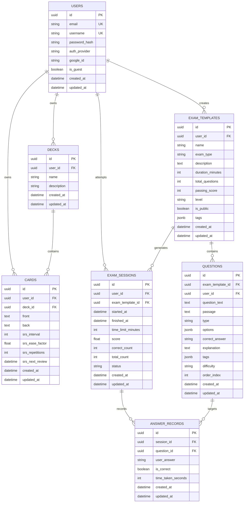

# 🏗️ Architecture & Database Schema

This document details the database model architecture, entity relationships, migration workflows, and schema design for LinguFlow's PostgreSQL database.

---

## 📊 Entity Relationship Diagram (ERD)



---

## 🗄️ Database Tables Specifications

### 1. `users` Table
Stores user accounts (standard email/password, Google OAuth2, and temporary guest accounts).
- `id`: `UUID` (Primary Key, default `gen_random_uuid()`)
- `email`: `VARCHAR(255)` (Unique, Indexed)
- `username`: `VARCHAR(100)` (Unique, Indexed)
- `password_hash`: `VARCHAR(255)` (Bcrypt hashed password, nullable for Google/Guest accounts)
- `auth_provider`: `VARCHAR(20)` (`"local"`, `"google"`, `"guest"`)
- `google_id`: `VARCHAR(255)` (Unique, Nullable)
- `is_guest`: `BOOLEAN` (Default `False`)
- `created_at` / `updated_at`: `TIMESTAMPTZ`

### 2. `decks` Table
Groups flashcards into custom study decks.
- `id`: `UUID` (Primary Key)
- `user_id`: `UUID` (Foreign Key -> `users.id` ON DELETE CASCADE)
- `name`: `VARCHAR(150)` (Required)
- `description`: `TEXT` (Optional)
- **Aggregation**: `card_count` is dynamically calculated via `Outer Join` on `cards.deck_id`.

### 3. `cards` Table
Stores flashcard pairs with SuperMemo-2 (SM-2) spaced repetition parameters.
- `id`: `UUID` (Primary Key)
- `user_id`: `UUID` (Foreign Key -> `users.id` ON DELETE CASCADE)
- `deck_id`: `UUID` (Foreign Key -> `decks.id` ON DELETE SET NULL, Nullable)
- `front`: `TEXT` (Prompt / word / phrase)
- `back`: `TEXT` (Definition / translation / example)
- `srs_interval`: `INTEGER` (Days until next review, default `0`)
- `srs_ease_factor`: `FLOAT` (Difficulty factor, default `2.5`, floor `1.3`)
- `srs_repetitions`: `INTEGER` (Successful consecutive reviews count, default `0`)
- `srs_next_review`: `TIMESTAMPTZ` (Scheduled review timestamp, default `now()`)

### 4. `exam_templates` Table
Stores certification practice exam templates (built-in public & custom user-created).
- `id`: `UUID` (Primary Key)
- `user_id`: `UUID` (Foreign Key -> `users.id` ON DELETE CASCADE, Nullable for public templates)
- `name`: `VARCHAR(255)` (Exam title)
- `exam_type`: `VARCHAR(50)` (`"toeic"`, `"ielts"`, `"hsk"`, `"jlpt"`, `"custom"`)
- `description`: `TEXT`
- `duration_minutes`: `INTEGER` (Time limit in minutes)
- `total_questions`: `INTEGER` (Total question count)
- `passing_score`: `INTEGER` (Passing threshold percentage, e.g. `60`)
- `level`: `VARCHAR(50)` (`"Intermediate"`, `"Advanced"`, `"N5"`, etc.)
- `is_public`: `BOOLEAN` (Default `False`)
- `tags`: `JSONB` (Array of tags)

### 5. `questions` Table
Contains questions belonging to an exam template.
- `id`: `UUID` (Primary Key)
- `exam_template_id`: `UUID` (Foreign Key -> `exam_templates.id` ON DELETE CASCADE)
- `user_id`: `UUID` (Foreign Key -> `users.id` ON DELETE CASCADE, Nullable)
- `question_text`: `TEXT` (Required prompt)
- `passage`: `TEXT` (Optional reading passage context)
- `type`: `VARCHAR(50)` (`"multiple-choice"`)
- `options`: `JSONB` (List of choice strings e.g. `["A. ...", "B. ..."]`)
- `correct_answer`: `VARCHAR(10)` (`"A"`, `"B"`, `"C"`, `"D"`)
- `explanation`: `TEXT` (Answer explanation)
- `difficulty`: `VARCHAR(20)` (`"easy"`, `"medium"`, `"hard"`)
- `order_index`: `INTEGER` (Display sequence order, default `0`)

### 6. `exam_sessions` Table
Tracks student exam attempts, elapsed times, and final scores.
- `id`: `UUID` (Primary Key)
- `user_id`: `UUID` (Foreign Key -> `users.id` ON DELETE CASCADE)
- `exam_template_id`: `UUID` (Foreign Key -> `exam_templates.id` ON DELETE CASCADE)
- `started_at`: `TIMESTAMPTZ` (Session start time)
- `finished_at`: `TIMESTAMPTZ` (Session completion time, Nullable)
- `time_limit_minutes`: `INTEGER` (Time limit)
- `score`: `FLOAT` (Percentage score `0.0` - `100.0`)
- `correct_count`: `INTEGER` (Total correct answers)
- `total_count`: `INTEGER` (Total questions)
- `status`: `VARCHAR(20)` (`"in-progress"`, `"completed"`, `"abandoned"`)

### 7. `answer_records` Table
Records candidate answers for each question during an exam session.
- `id`: `UUID` (Primary Key)
- `session_id`: `UUID` (Foreign Key -> `exam_sessions.id` ON DELETE CASCADE)
- `question_id`: `UUID` (Foreign Key -> `questions.id` ON DELETE CASCADE)
- `user_answer`: `VARCHAR(10)` (Selected answer choice e.g. `"B"`)
- `is_correct`: `BOOLEAN` (Result flag)
- `time_taken_seconds`: `INTEGER` (Time spent on question)

---

## 🛠️ Alembic Database Migration Workflow

Alembic handles version control and schema migrations for PostgreSQL.

```bash
# Generate a new migration script automatically from SQLAlchemy models
alembic revision --autogenerate -m "Add new table"

# Upgrade database to latest schema version
alembic upgrade head

# Downgrade database by 1 migration step
alembic downgrade -1
```
