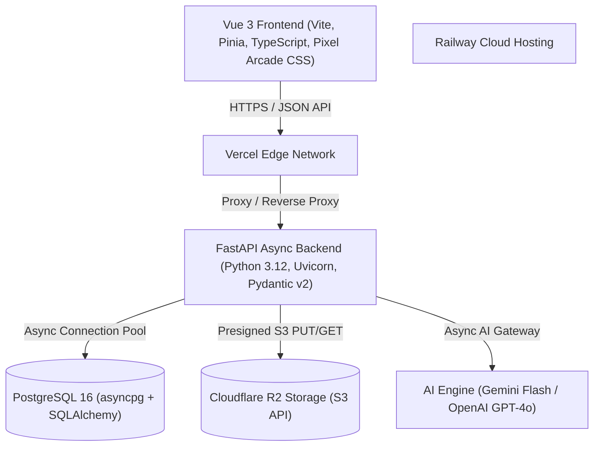

# 🧠 LinguFlow Wiki

Welcome to the **LinguFlow** official technical wiki and documentation hub.

LinguFlow is a modern, high-performance, keyboard-driven language certification platform designed for HSK, JLPT, TOEIC, and IELTS candidates. It combines a distraction-free Vue 3 pixel-art arcade interface with an async Python FastAPI backend, PostgreSQL relational database, SuperMemo-2 (SM-2) spaced repetition engine, and multi-provider AI assistance (Gemini Flash & GPT-4o).

---

## 📚 Documentation Directory

| Wiki Page | Description |
|---|---|
| [**Architecture & Database Schema**](file:///c:/Vault/Project/learning-platform/lingu-flow/docs/wiki/Architecture-and-Database-Schema.md) | Layered architecture, ER diagrams, 7 PostgreSQL models, Alembic migrations, and database design. |
| [**API Documentation**](file:///c:/Vault/Project/learning-platform/lingu-flow/docs/wiki/API-Documentation.md) | Complete OpenAPI specs for Auth, Flashcards, Decks, Exam Simulator, SSE Progress Events, and Media. |
| [**Spaced Repetition (SM-2)**](file:///c:/Vault/Project/learning-platform/lingu-flow/docs/wiki/Spaced-Repetition-SM2.md) | Deep dive into the SM-2 mathematical model, quality mapping, ease factor bounds, and review queues. |
| [**Deployment & DevOps Guide**](file:///c:/Vault/Project/learning-platform/lingu-flow/docs/wiki/Deployment-Guide.md) | Deployment blueprints for Vercel (Frontend), Railway (FastAPI + PostgreSQL), Cloudflare R2, and Docker Compose. |

---

## 🛠️ Technology Stack Overview

### 1. Frontend Architecture
- **Framework**: Vue 3 (Composition API `<script setup>`), TypeScript, Pinia State Management, Vue Router 4.
- **Design System**: Arcade Pixel Art CSS design system (`arcade.css`), `Press Start 2P`, `IBM Plex Mono`, and `IBM Plex Sans` typography.
- **Key Views**: `AuthView.vue`, `FlashcardsView.vue`, `DeckManagementView.vue`, `CardManagementView.vue`, `ExamHub.vue`, `ExamCreator.vue`, `ExamResults.vue`.

### 2. Backend Architecture
- **Framework**: FastAPI (Python 3.12+), Pydantic v2 schemas, `uvicorn` ASGI server.
- **ORM & Database**: SQLAlchemy 2.0 (Async Engine) with `asyncpg` driver for PostgreSQL 16.
- **Security & Auth**: `bcrypt` password hashing, `python-jose` JWT authentication, Google OAuth2, in-place guest account migration.
- **Real-Time Streaming**: `sse-starlette` Server-Sent Events (SSE) progress engine.

---

## 🚀 Key Features

> [!TIP]
> **Key Features at a Glance**:
> - **SM-2 Spaced Repetition**: Dynamic card scheduling based on user memory retention scores (1-4).
> - **Full Exam Simulator**: Timed certification practice sets with question passages, multiple-choice options, instant scoring, and detailed review maps.
> - **In-Place Guest Account Migration**: Guest users can register at any time without losing a single flashcard or study deck.
> - **33 Built-in Practice Questions**: Pre-seeded exams for TOEIC Part 5, IELTS Academic Reading, HSK Level 2, and JLPT N5.
